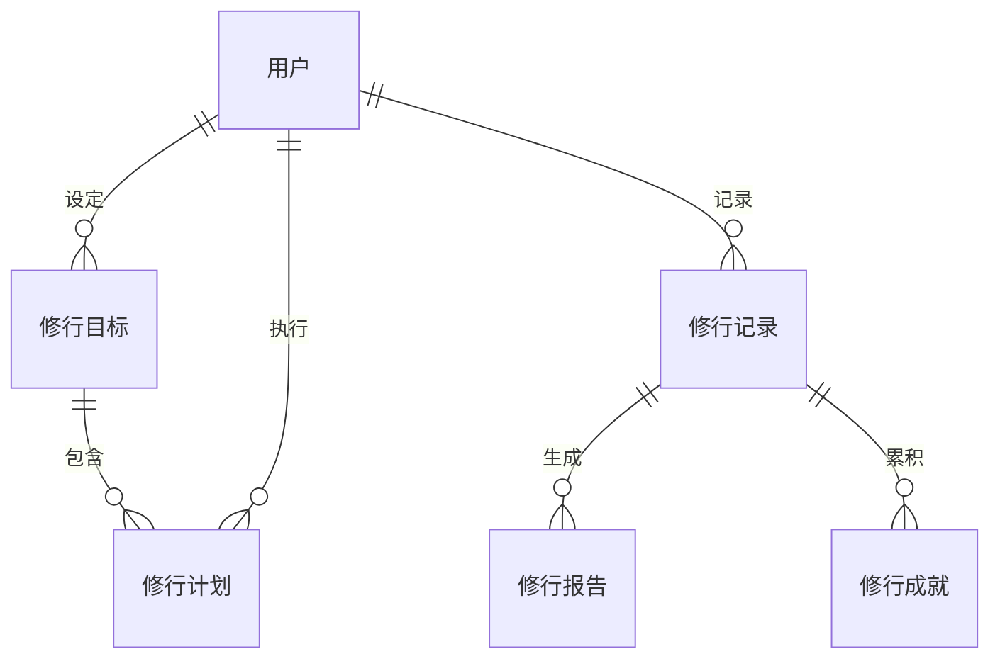

## 觉行助手

### 需求背景

随着社会的快速发展，人们的生活节奏越来越快，娱乐至死的现象日益严重。许多人在工作和生活中面临着巨大的压力，导致心理健康问题日益突出。为了帮助人们更好地应对这些挑战，我们提出了“觉行助手”这一项目。通过身、心、灵的全面修行，解决人们内心空虚、焦虑等问题，提升生活质量和工作效率。

### 目标用户

所有想要提升心理健康水平、改善生活质量的用户。

### 核心概念

修行目标可以是长期目标（如保持身体力量、协调性、柔韧性等）或短期目标（如读完《刀锋》，学会演奏钢琴曲《夜的钢琴曲 3》等）。用户可以根据自己的需求设定修行目标，并制定相应的修行计划。
修行计划必须具体。例如：每天阅读《刀锋》50 页；每天深蹲 100 个；每天打坐冥想 20 分钟；每天写日记 500 字；练钢琴曲《夜的钢琴曲 3》 5 个小节速度 80 不能出错 20 遍等。
修行记录应包含具体数量和感想。

### 核心功能

1. **目标与修行计划管理**：用户可以设定个人目标，并制定相应的修行计划，系统会提供相应的建议和指导。
2. **修行提醒**：定期提醒用户进行修行活动，如冥想、运动等，帮助用户养成良好的生活习惯。
3. **修行记录**：用户可以记录自己的修行过程和感受，系统会根据记录提供反馈和建议。
4. **修行报告**：定期生成用户的修行报告（月度、季度、半年、一年），分析用户的进步和需要改进的地方。
5. **修行积累展示**：展示用户的修行成果，如冥想时长、运动量等，激励用户持续修行。

### 系统架构

第一阶段考虑单体客户端应用，后续考虑添加服务器进行数据同步和其他功能扩展。
前端使用 Tauri + Vue3 + Naive UI，后端使用 Rust 进行逻辑处理，数据存储使用 SQLite。
开始以安卓端为主，后续考虑 iOS 端和桌面端以及 Web 端。

### 技术栈

1. **Tauri**：用于构建跨平台的桌面应用，提供良好的用户体验和性能。
2. **Vue3**：用于构建前端界面，提供响应式和现代化的用户界面。
3. **Naive UI**：用于提供美观的 UI 组件，提升用户界面的友好性和易用性。
4. **Rust**：用于后端逻辑处理，提供高性能和安全性。
5. **SQLite**：用于本地数据存储，提供快速和可靠的数据访问。
6. **AI**：集成 AI 技术，提供推荐和个性化的修行建议。

### 项目结构

项目将分为前端和后端两部分，使用 Rust 工作区管理。

### 界面设计

1. **首页**：展示用户的修行计划，提供修行提醒、修行计划执行记录等功能。
2. **计划**：用户可以创建、编辑和删除修行目标和计划，系统会提供相应的建议。
3. **记录**：以日历形式展示用户的修行记录，支持查看某天的记录详情。
4. **我的**：用户可以查看自己的修行成就，包括已完成的目标和获得的奖励。包含一些菜单，比如设置 AI 大模型的类型和 API Key，系统设置及后续的登录之类的功能。
